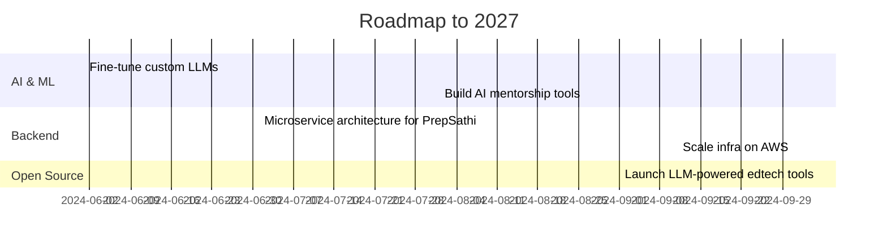

  

  
<strong>🚀 Full Stack Dev | 🧠 AI Innovator | 🔧 System Optimizer</strong>

  
Breaking systems, building futures. Welcome to the code zone.

---

## 🧠 About Me

Backbencher-turned-builder. I break, fix, and scale code like second nature. From hacking out web apps in dorm rooms to shipping AI-integrated platforms—I've lived the bugs, fought the fire, and engineered the upgrades.

---

## ⚙️ Tech Arsenal

| Frontend       | Backend                      | AI/LLM                               | DevOps & Cloud              | DBs                        |
| -------------- | ---------------------------- | ------------------------------------ | --------------------------- | -------------------------- |
| React, Next.js | Node.js, Django, Spring Boot | OpenAI, LangChain, Whisper, Pinecone | AWS, Docker, GitHub Actions | PostgreSQL, MongoDB, Redis |

---

## 🔥 Featured Projects

### 🎯 [PrepSathi.in](https://prepsathi.in)

AI-powered UPSC companion: quizzes, feedback, essay mentorship, and real-time guidance. [Visit Website](https://prepsathi.in){\:target="\_blank"}

### 🛠️ AI Jarvis (Multilingual Assistant)

Custom AI assistant with voice + command control in Hindi/English. Built with LLMs + OS automation.

### 📡 Real-time System Monitor

React + WebSocket dashboard powered by Prometheus. Built for scale, debugged with style.

### 🛍️ E-commerce Backend

Robust APIs, payment gateways, and microservices for a production-ready platform.

---

## 🧬 My Dev Philosophy

* 💡 Build smart, not fancy
* 🧼 Write code like someone will read it in production (because they will)
* 🚀 Automate what you hate
* 🧠 Always learning, always optimizing

> "Disrupt systems, don't decorate them."

---

## 🧠 Personal Roadmap

---

## 📫 Connect With Me

* 🧑‍💻 <a href="https://keshavx.vercel.app/" target="_blank">Portfolio</a>
* 💼 <a href="https://www.linkedin.com/in/keshav-k-mishra-b3089b165/" target="_blank">LinkedIn</a>
* 📬 <a href="mailto:keshav0730@gmail.com" target="_blank">Email</a>
* 🐦 <a href="https://twitter.com/keshavmishra" target="_blank">Twitter</a>

---

## 📈 Visitor Count

---

  
   
  

---

> You’re not just reading a README — you’re reading a roadmap to the future.

---

  

