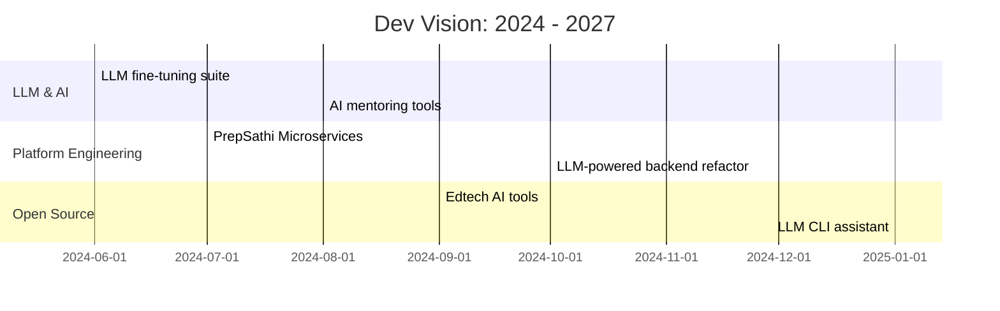

  

  
<strong>💻 Full Stack Warrior | 🤖 LLM Alchemist | ⚙️ System Sculptor</strong>

  
Architecting the future—one algorithm at a time.

---

## 🧠 About Me

Digital craftsman. AI whisperer. System disruptor. I thrive at the intersection of logic and creativity, building fast, breaking smart, and solving real-world chaos with scalable elegance.

---

## ⚙️ Tech Arsenal

| Frontend       | Backend                      | AI/LLM                                             | DevOps & Cloud                      | DBs                                  |
| -------------- | ---------------------------- | -------------------------------------------------- | ----------------------------------- | ------------------------------------ |
| React, Next.js | Node.js, Django, Spring Boot | OpenAI, LangChain, Whisper, Transformers, Pinecone | AWS, Docker, GitHub Actions, Vercel | PostgreSQL, MongoDB, Redis, Supabase |

---

## 🚀 Featured Projects

### 🎯 PrepSathi.in

Your UPSC AI mentor. Adaptive quizzes, instant feedback, essay evaluation, and smart nudges to help aspirants crack the code.

### 🤖 AI Jarvis (Multilingual Assistant)

Hindi-English voice assistant that performs system tasks, generates code, and learns via fine-tuned LLMs. Think local Jarvis with desi swag.

### 📊 Real-time System Monitor

Visualize your servers in style. React + WebSocket dashboard with Prometheus & Grafana under the hood.

### 🛍️ Microservices E-Commerce

Microservice-based full stack backend with payment integrations, product catalog, and event-driven design.

---

## 💡 Dev Philosophy

* 🧠 Learn deeply, code simply
* ⚡ Performance is product
* 🔄 Reuse, refactor, repeat
* 🧬 Build what breaks limits

> "I don’t write code. I write future-proof functions."

---

## 🧠 Personal Roadmap

---

## 🧩 Toolbelt

---

## 🔗 Connect With Me

* 🌐 <a href="https://keshavx.vercel.app/" target="_blank">Portfolio</a>
* 💼 <a href="https://www.linkedin.com/in/keshav-k-mishra-b3089b165/" target="_blank">LinkedIn</a>
* ✉️ <a href="mailto:keshav0730@gmail.com" target="_blank">Email</a>

---

## 📊 GitHub Stats

  
   
  

---

## 🔥 Live Counter

---

> You’re not scrolling through a README. You’re scanning a mission log.

---

  

