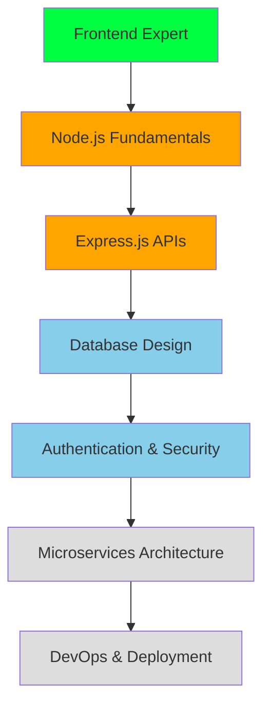
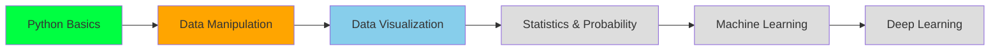

# 🌐 FRONTEND ARCHITECT • EVOLVING INTO FULL-STACK QUANTUM

```diff
+ ✅ FRONTEND MASTERY: LEVEL 100 ACHIEVED
+ ✅ BACKEND PROTOCOLS: LEARNING MODE ACTIVE
+ ✅ DATA SCIENCE PATHWAYS: NEURAL TRAINING INITIATED  
+ ✅ UI/UX QUANTUM ENGINE: FULLY OPERATIONAL
- ⚠️  PIXEL-PERFECT OBSESSION: MAXIMUM INTENSITY
- 🔄 CONTINUOUS EVOLUTION: NEVER-ENDING UPGRADE CYCLE
```

<div align="center">


[](https://git.io/typing-svg)

</div>

---

## 🧬 **DEVELOPER EVOLUTION MATRIX**

```typescript
interface FrontendArchitect {
  readonly role: "Frontend Specialist";
  readonly experience: "Expert Level";
  readonly currentFocus: ["UI/UX Excellence", "Performance Optimization"];
  readonly learningPath: ["Backend Development", "Data Science", "ML/AI"];
}

class KeshavMishra implements FrontendArchitect {
  private skillLevel = {
    frontend: 95,        // 🔥 Expert Level
    backend: 45,         // 📈 Rapidly Growing
    dataScience: 25,     // 🌱 Foundation Building
    uiux: 90,           // 🎨 Design-First Mindset
    performance: 85      // ⚡ Speed Obsessed
  };
  
  async evolutionCycle(): Promise<void> {
    while (this.isAlive) {
      await this.perfectPixels();
      await this.optimizePerformance();
      await this.learnBackendConcepts();
      await this.exploreDataPatterns();
      await this.pushBoundaries();
      this.levelUp();
    }
  }
  
  getCurrentMission(): string {
    return "Transforming complex ideas into intuitive, blazing-fast web experiences";
  }
}
```

<div align="center">

### 🎯 **DEVELOPER STATUS**
[](#)
[](#)
[](#)
[](#)

</div>

---

## 🚀 **SKILL PROGRESSION RADAR**

<div align="center">

### ⚡ **FRONTEND MASTERY (95% COMPLETE)**


### 🎨 **UI/UX DESIGN ARSENAL**


### 🔧 **DEVELOPER TOOLS & PERFORMANCE**


### 📈 **BACKEND LEARNING JOURNEY (45% PROGRESS)**


### 🧠 **DATA SCIENCE EXPLORATION (25% PROGRESS)**


### ☁️ **DEPLOYMENT & DEVOPS**


</div>

---

## 📊 **PERFORMANCE ANALYTICS**

<div align="center">


</div>

<div align="center">


</div>

---

## 🎯 **LEARNING PROGRESS TRACKER**

<div align="center">

### 📚 **CURRENT BACKEND LEARNING PATH**


### 🔬 **DATA SCIENCE EXPLORATION ROADMAP**


</div>

---

## 🏆 **ACHIEVEMENT SHOWCASE**

<div align="center">

[](https://github.com/ryo-ma/github-profile-trophy)

</div>

## 🌟 **DAILY INSPIRATION FEED**

<div align="center">


</div>

---

## 🔥 **CONTRIBUTION HEATMAP**

<div align="center">

<picture>
  <source media="(prefers-color-scheme: dark)" srcset="https://raw.githubusercontent.com/yourusername/yourusername/output/github-contribution-grid-snake-dark.svg">
  <source media="(prefers-color-scheme: light)" srcset="https://raw.githubusercontent.com/yourusername/yourusername/output/github-contribution-grid-snake.svg">
  
</picture>

</div>

---

## 📈 **LEARNING JOURNEY HIGHLIGHTS**

<div align="center">

| 🎯 **MASTERED** | 📚 **LEARNING** | 🔮 **NEXT UP** |
|:---:|:---:|:---:|
| React Ecosystem | Node.js & Express | Advanced ML/AI |
| TypeScript | Database Design | Cloud Architecture |
| Modern CSS | API Development | DevOps Mastery |
| UI/UX Design | Authentication | Data Engineering |
| Performance Optimization | Backend Architecture | System Design |

</div>

---

## 🌐 **CONNECT WITH THE ARCHITECT**

<div align="center">

[](https://www.linkedin.com/in/keshav-k-mishra-b3089b165/)
[](https://thebatcave.in)
[](https://keshavdev.netlify.app/)
[](#)
[](#)

</div>

---

<div align="center">

## 💫 **FRONTEND ARCHITECT'S MANIFESTO**

```
╔══════════════════════════════════════════════════════════════╗
║  "Great frontend is invisible - users don't notice it       ║
║   because it just works. That's the art of interface craft" ║
║                                                              ║
║  "Learning never stops. Today's React expert is tomorrow's  ║
║   full-stack architect, and next year's data scientist"     ║
║                                                              ║
║  - Keshav Mishra, Frontend Architect & Eternal Student      ║
╚══════════════════════════════════════════════════════════════╝
```

### 🚀 **CURRENT PROJECT FOCUS**


</div>

---

<div align="center">


**⚡ FRONTEND ARCHITECT • EVOLVING INTO FULL-STACK • NEVER STOP LEARNING ⚡**


</div>
